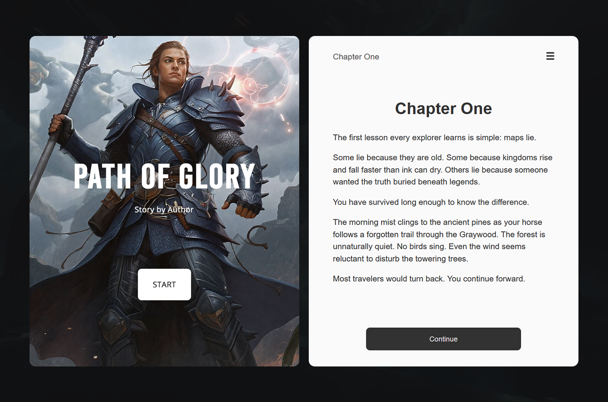
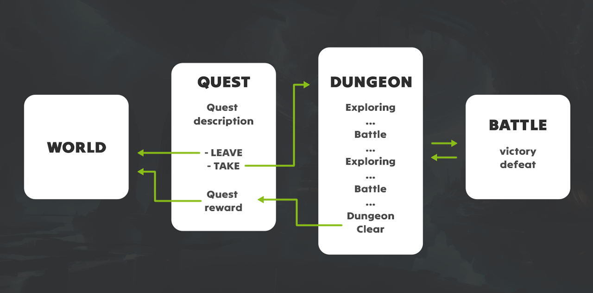
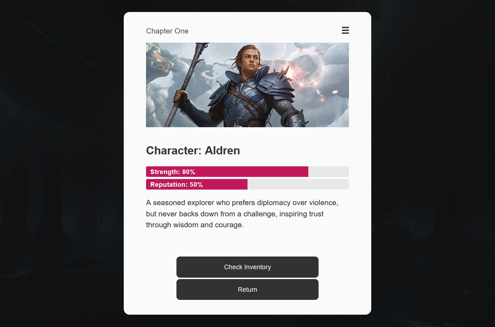
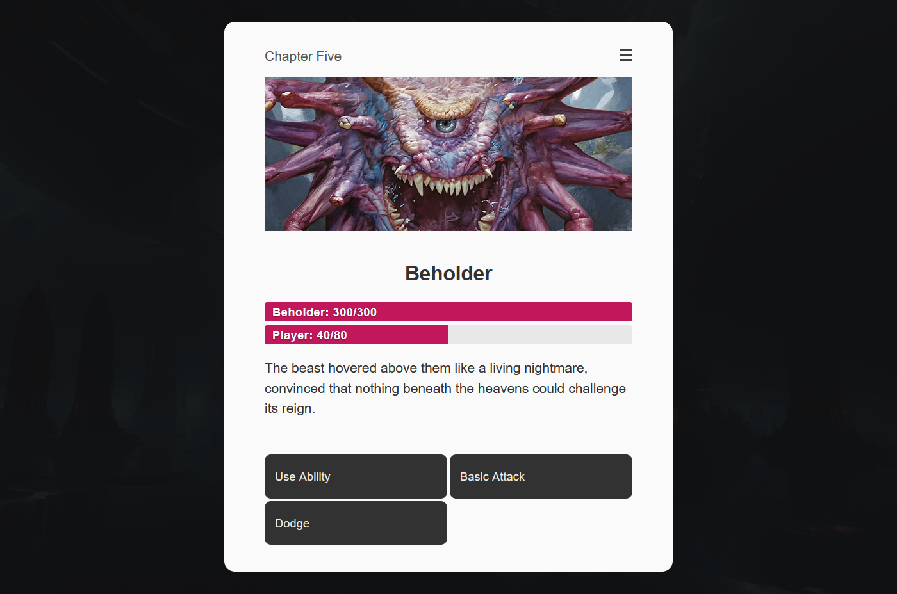
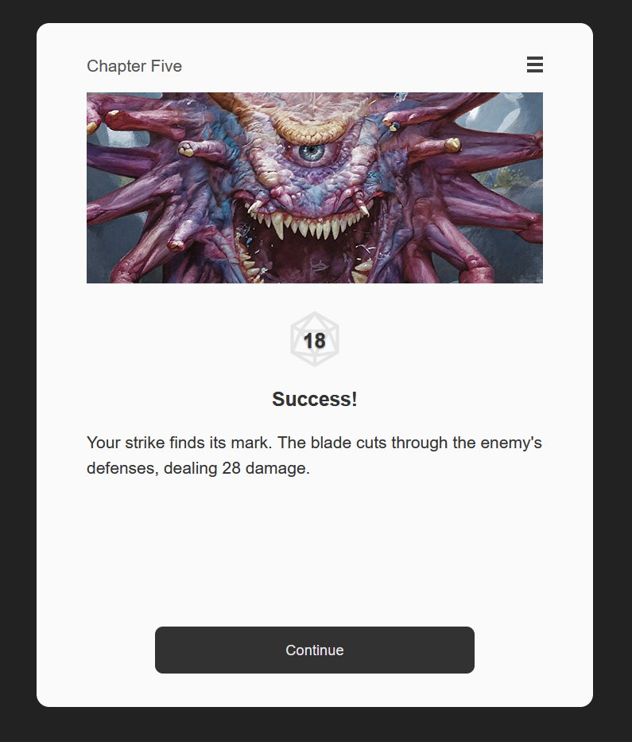
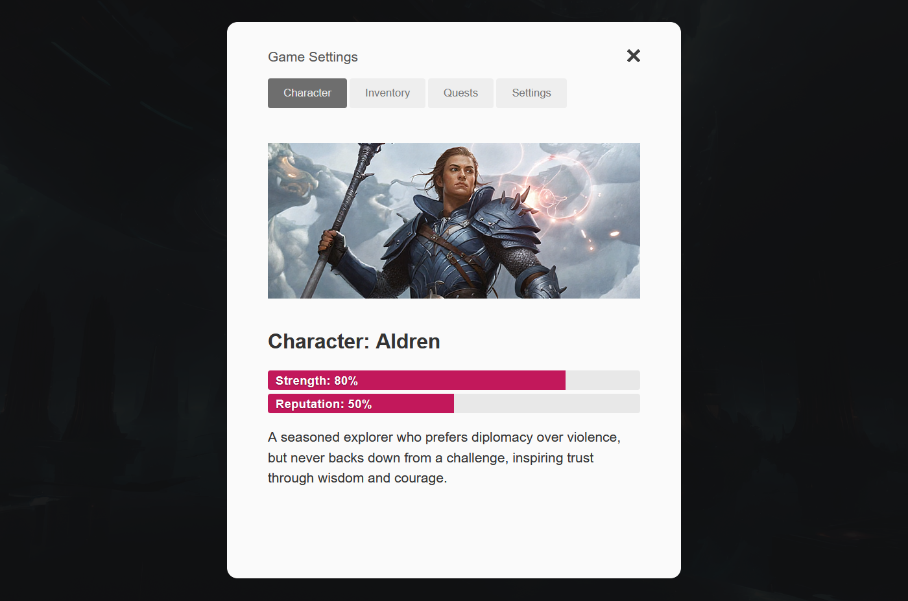

# Harrow


# Introduction

**Harrow Twine** is a Twine 2 story format built on the [Harrow](https://github.com/nayata/harrow) narrative library.

Unlike formats such as **Harlowe** or **SugarCube**, Harrow Twine focuses on a structured, gamebook-style experience inspired by **Choice of Games**. Readers progress through self-contained pages, make dialogue-style choices, and see only the options that are currently available based on the game's state.

Harrow provides a concise scripting language with built-in support for variables, conditions, arithmetic expressions, dice rolls, and Fairmath-style statistics. Common RPG and visual novel features are available without additional scripting, allowing authors to focus on writing instead of UI implementation.

### Features

* **Page-based storytelling** inspired by Choice of Games.
* **Dialogue-style choices** with conditional visibility.
* **Variables, conditions, arithmetic expressions, and dice rolls.**
* **Fairmath-style** stat calculations for RPG progression.
* **Built-in stat and progress bars.**
* **Image display** directly inside passages.
* **Animated dice roll visualization.**
* **Title screen** and a customizable **Settings** screen with font size, font family, theme selection, restart, and return options.
* Fully compatible with the Harrow story syntax while adding **Twine**-specific features and interface components.


## Installation

1. Open Twine 2 (desktop or [web version](https://twinery.org/2/)).
2. Go to **Story Formats** from the Twine library screen.
3. Click **Add a New Format**.
4. Paste the following Story Format URL:
```
https://nayata.github.io/format/format.js
```
5. Once loaded, open any story's settings and select **Harrow** as its story format.


## Writing Stories



A Harrow Twine story consists of **passages**. Each passage represents a complete scene. The story begins in the first passage and continues by moving to other passages.

The example below demonstrates the basic concepts:

* variables
* text
* choices
* conditional blocks
* moving between passages

```harrow
[relic = Moonstone Idol]
[torch = false]

You enter the Whispering Cave in search of the lost [relic].
A narrow passage leads deeper underground.

- Light a torch : torch = true
- Walk into the darkness

[if torch is true]
    You light your torch.

    The torch reveals a hidden spike trap. You carefully make your way past it.
    The tunnel ends at an ancient stone altar.

    [move Victory]
[else]
    Hidden spikes spring from the floor.

    [move Defeat]
[end]

# Victory

You claim the [relic] and leave the cave safely.

[close]

# Defeat

Your adventure ends in the darkness.

[close]
```

This example introduces most of the concepts you'll use throughout the documentation. The following chapters explain each feature in detail.


## Text

Text is written naturally inside passages without requiring special formatting.

Unlike traditional Twine story formats, **Harrow Twine** automatically presents long passages one page at a time. When the current page becomes full, the remaining text is hidden until the reader presses **Continue**.

You can also insert a manual page break by placing `--` on its own line.

```harrow
The first part of the story.
--
The reader must press Continue before this text is shown.
```

This is useful for controlling pacing, dramatic pauses, or revealing information at specific moments. 

The amount of text displayed before a page break can be adjusted with the `config.text.fill` configuration option. Setting a low `config.text.fill` value creates a visual novel–style presentation, where dialogue and narration are revealed in short segments. See **Configuration** for details.


#### HTML Support

Passages can contain standard HTML alongside normal story text. This makes it easy to add headings, styled text, inline images, or other HTML elements when needed.

Commonly used elements include `<h2>`, `<span>`, and ``.


## Choices

Choices are created by starting a line with the `-` symbol.

A choice consists of the visible text followed by one or more optional fields separated by `:`.

```harrow
- Text : Route : Variable Action : Condition
```

All fields except the choice text are optional.

* **Route** — moves to another passage.
* **Variable Action** — modifies a variable or performs another supported variable operation.
* **Condition** — controls whether the choice is available.

Examples:

```harrow
- Enter the cave : Cave
- Light a torch : torch = true
- Climb the cliff : Cliff : stamina - 10
- Continue
```

A choice with no additional fields simply continues the current passage.

#### Conditional Choices

The optional fields may appear in **any order**. Harrow Twine automatically determines whether each field represents a route, variable action, or condition.

A condition can be added to control whether a choice is available.

```harrow
- Open the treasure chest : Treasure : hasKey is true
- Search the ruins : energy >= 20 : Ruins : energy - 20
- Open the ancient gate : hasKey is true : Gate
```

If the condition evaluates to **false**, the choice remains visible but is disabled. Disabled choices receive the CSS class `disabled` and cannot be selected.

By default, disabled choices remain visible so the player can see that the option exists but is currently unavailable. If preferred, they can be hidden entirely by overriding the `.disabled` CSS class.


## Branching

Branching in Harrow is done using **routes**, which are declared with the `#` symbol at the beginning of a line.

```harrow
# Village

You arrive at the village square.
```

In Harrow Twine, routes are the equivalent of **Twine passages**. Each passage represents a separate route that can be reached through choices or actions such as `[move]`.

Route names must be **unique** throughout the story.

In addition to Twine's visual passage editor, Harrow Twine also supports **Twee notation** using the `::` syntax.

```twee
:: Village

You arrive at the village square.

- Visit the tavern : Tavern
- Leave town : Forest

:: Tavern

The tavern is warm and crowded.

[move Village]

:: Forest

The trees quickly swallow the road behind you.

[close]
```

**Important:** Execution always remains within the current route. If processing reaches the beginning of another route without an explicit jump, execution stops automatically rather than continuing into the next route.

This allows multiple route definitions to exist in the same source while ensuring that each route is entered only through a choice or an action such as `[move]`.


## Variables

Variables are declared using square brackets and the `=` operator.

```
[gold = 50]
```

Variables can store numbers or strings.

```
[quest = Find the tomb of the forgotten king.]
[quest.status = completed]
```


#### Random

A variable can be assigned a random value:

```
[dice roll 20]
```


#### Variable operations

Basic mathematical operations (`+`, `-`, `*`, `/`, and `%`) are supported. Other variables can be used in calculations.

```
[damage = 20]
[critical roll 20]
[damage + critical]

[enemy.health - damage]
```


#### Printing variables

The value of a variable can be displayed in text using square brackets.

```
[gold = 50]
You have [gold] gold coins.
```

Variables can also be shown inside choices.

```
- I have [gold] gold coins.
- This is too much for this information.
```


## Conditional blocks

A simple `if`.

```
[torch.lit = true]

[if torch.lit == true]
    The torch casts long shadows across the stone walls.
[end]
```

`if/else` condition. As an alternative to `==`, Harrow also supports the `is` operator for equality comparisons.

```
[if torch.lit is true]
    The torch casts long shadows across the stone walls.
[else]
    Darkness swallows everything beyond the first few steps.
[end]
```


## Actions

Actions control the flow of the story. They are used to perform operations such as moving to another passage, opening a scene, or ending the game.

Unlike variables and conditions, actions do not store or check data — they perform an immediate operation when the passage is processed.


## Move

`[move PassageName]` Moves the story to another passage.


## Scene



`[scene PassageName]` Opens another passage as a scene while remembering the current location. When the scene is closed with `[scene close]`, the story returns to the place where the scene was opened.

`[scene close]` — returns to the previous scene.
`[scene clear]` — clears the entire scene stack.

Scenes use a stack system, which allows them to be nested arbitrarily deep.

For example, a game can open a **quest screen**, then a **dungeon screen** from within the quest, and finally a **battle screen** from the dungeon. Closing each scene returns the player back through the same path:

**Battle → Dungeon → Quest → World**


## Bookmark & Return

`[bookmark]` Stores the current location as a return point.

`[return]` Returns to the saved bookmark.

`[bookmark clear]` Removes the saved bookmark.

Unlike scenes, bookmarks use a single return slot. Creating a new bookmark replaces the previous one.

A choice can also use `return` directly instead of a passage name:

```harrow
[bookmark]

You step out of the entry portal into the abandoned Central Plaza. 
Once a thriving nightlife hub, now it’s a ghost town of flickering neon and drifting trash.
In the distance, the skeletal silhouette of the old factory looms beyond layers of fog.

- Check your gear : Inventory
- Continue

...

# Inventory

Your plasma rifle hums softly, charging indicator glowing blue. Standard-issue, reliable.
Base Damage: [damage]

- Back : return
```


## Chapter

`[chapter Chapter Name]` Updates the chapter title displayed in the story header.

This can be changed at any point during the story and does not affect the story flow.


## Close

`[close]` Ends the story and displays the ending screen.

The text of the ending screen can be customized through the story configuration:

```harrow
[config.text.end <h2>That is where the story ends.</h2>]
```


## CoG-style Fairmath



Harrow Twine includes support for **Fairmath**, the percentage-based stat system popularized by *Choice of Games*.

Unlike simple addition and subtraction, Fairmath makes large values harder to increase and small values harder to decrease. This produces smooth character progression without allowing statistics to reach their minimum or maximum too quickly.

Fairmath is available for any numeric variable using the `%+` and `%-` operators.

```harrow
[strength %+ 20]
[morality %- 15]
```

Because Fairmath values are stored as normal variables, they can be used anywhere a regular variable can be used, including conditions.

```harrow
[if strength >= 70]
    You effortlessly force the door open.
[else]
    The door refuses to budge.
[end]
```

#### Displaying Stats

A Fairmath variable can be displayed as a built-in progress bar using the `stat` command.

```harrow
[stat strength]
```

The current value is shown both numerically and visually, making it ideal for character attributes such as strength, reputation, health, morale, or relationships.

Example:

```harrow
Character: [player.name]

Strength
[stat strength]

Reputation
[stat reputation]

A seasoned explorer who prefers diplomacy over violence, but never backs down from a challenge.
```


## Bar



The `bar` command displays a variable as a progress bar together with its current and maximum values.

```harrow
[bar health]
```

By default, the maximum value is **100**, so a variable with a value of `75` is displayed as **75 / 100**.

#### Custom Maximum Values

A variable's maximum value can be customized by defining a companion variable with the `.max` suffix.

```harrow
[health.max = 80]
[health = 80]

[bar health]
```

The progress bar will now display **80 / 80** instead of **80 / 100**.

This is useful for values that do not naturally use a 0–100 scale, such as health, mana, stamina, ammunition, or experience.


## Dice



Harrow Twine supports dice rolls for RPG mechanics, random events, and skill checks.

The `roll` operator can use either a simple numeric range or standard dice notation.

`[hit roll 10]` Rolls a random value between **1** and **10**.

Alternatively, you can use dice notation:

```harrow
[damage roll 1d20]
[damage roll 2d6]
[damage roll 3d8]
```

The format is **XdY**, where:

* **X** is the number of dice.
* **Y** is the number of sides on each die.

When multiple dice are rolled, their values are added together.

#### Highest and Lowest Rolls

Dice notation also supports the `h` (**highest**) and `l` (**lowest**) modifiers.

```harrow
[attack roll 3d6h]
[penalty roll 3d6l]
```

`3d6h` rolls three six-sided dice and keeps only the **highest** result.

`3d6l` rolls three six-sided dice and keeps only the **lowest** result.

#### Displaying Dice

The result of a dice roll can be displayed using the `dice` command.

```harrow
[dice critical]
```

This renders the variable as a die showing its current value, making dice rolls easy to highlight during gameplay.

Example:

```harrow
[attack roll 1d20]

Attack Roll

[dice attack]

[if attack >= 15]
    A solid hit!
[else]
    The attack misses.
[end]
```


## Imagebox

The imagebox is a built-in container for displaying images alongside the story. It is hidden by default and can display images from either a local file or a remote URL.

#### Displaying an Image

```harrow
[image images/castle.png]
[image https://example.com/castle.png]
```

Setting an image automatically updates the imagebox and makes it visible.

#### Showing and Hiding

The imagebox can be shown or hidden without changing its current image.

`[image show]` — shows the imagebox.
`[image hide]` — hides the imagebox.

This makes it easy to reuse the same image throughout multiple passages without loading it again.


## Settings Screen

The built-in **Settings** screen provides several options for customizing the reading experience:

* **Font Size** — cycles between **Default**, **Large**, and **Small**. This affects the story textbox only.
* **Font Family** — cycles between the page's default font and a serif alternative. This setting applies to the entire page (`body`).
* **Theme** — cycles between **Light** and **Dark**.
* **Restart the Game** — restarts the story from the beginning.
* **Return** — closes the Settings screen and resumes the story.


## Custom Tabs



The Settings screen can be extended with your own tabs, similar to the **Show Stats**, **Achievements**, and **Menu** screens found in *Choice of Games*.

To add a custom tab, assign the **`menu`** tag to any passage in the Twine editor. Each tagged passage automatically appears as a new tab using the passage name as its title. Selecting a tab loads that passage into the Settings screen without interrupting the current story.

The content of a menu passage supports:

* regular text
* `[if]` / `[else]` / `[end]` (including nested conditions)
* `[stat]`
* `[bar]`

**Menu passages are read-only.** They do not execute variable assignments or other state-changing operations such as `=`, arithmetic operators (`+`, `-`, `%+`, `%-`, etc.), `roll`, and similar operations. Opening a tab displays the current state of the story without modifying it.


## Title Screen

When the story starts, Harrow Twine displays a built-in title screen showing the story title.

Below the title is a reserved line for the author's name. Since Twine does not provide author metadata, Harrow Twine reads it from a passage named **`StoryAuthor`**.

Create a passage with that exact name and place the author's name (or any other text) inside it. If the `StoryAuthor` passage is not present, the default placeholder **"Story by Author"** is displayed.


## Configuration

Configuration options allow you to customize story behavior and interface elements.

Configuration commands should be placed near the beginning of the story, before any content is displayed.

```harrow
[config.parse.speaker true]
[config.text.fill 80]
[config.dialogue.vertical 3]
[config.settings.title Game Settings]
[config.text.end <h2>That is where the story ends.</h2>]
[config.assets.folder images/]
```

Available options:

* **`config.parse.speaker`** — enables or disables speaker formatting for dialogue lines written as `Name: text`. When enabled, the speaker name is wrapped in a styled `<span class="speaker">` element.
* **`config.text.fill`** — percentage of the textbox height used before a page break is created. Lower values create shorter pages.
* **`config.dialogue.vertical`** — number of choices after which dialogue choices switch from vertical to horizontal layout.
* **`config.settings.title`** — title displayed at the top of the Settings screen.
* **`config.text.end`** — text displayed when the story ends or when `[close]` is used.
* **`config.assets.folder`** — base path used by `[image ...]` for local image assets.
